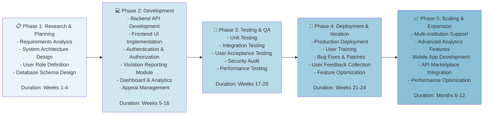
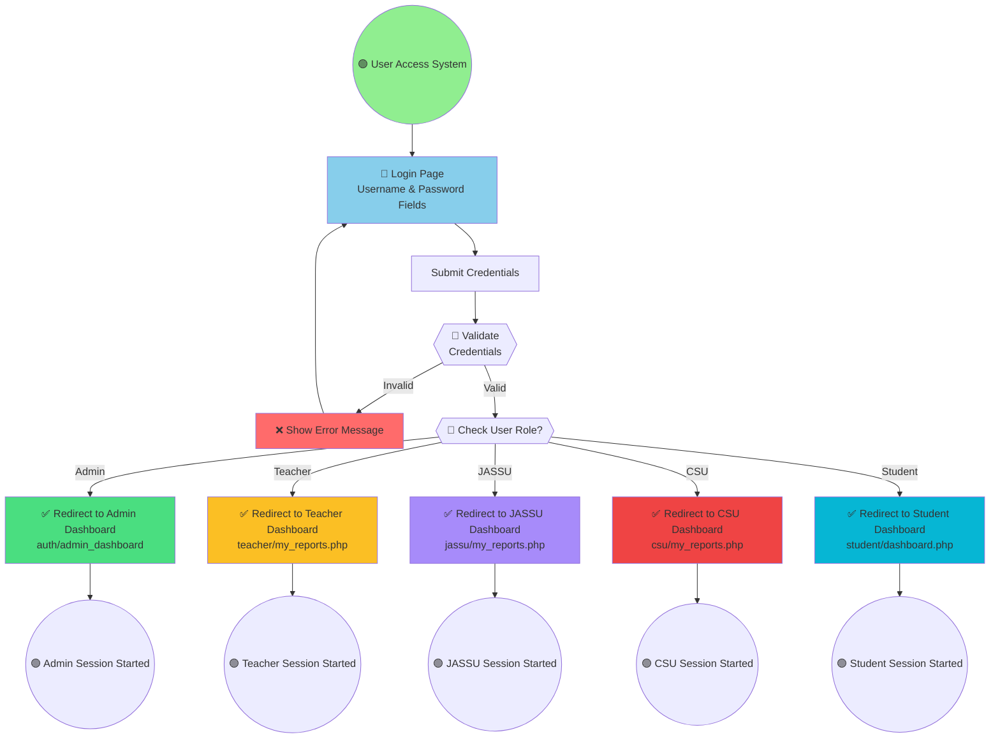
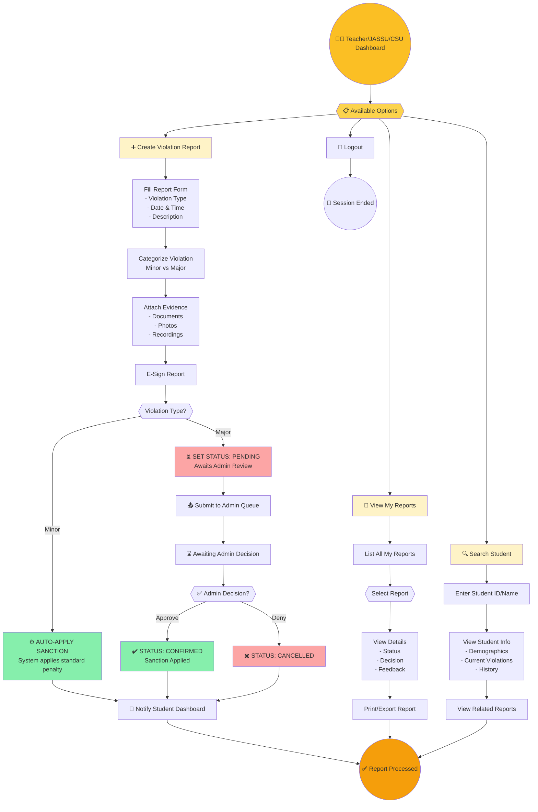
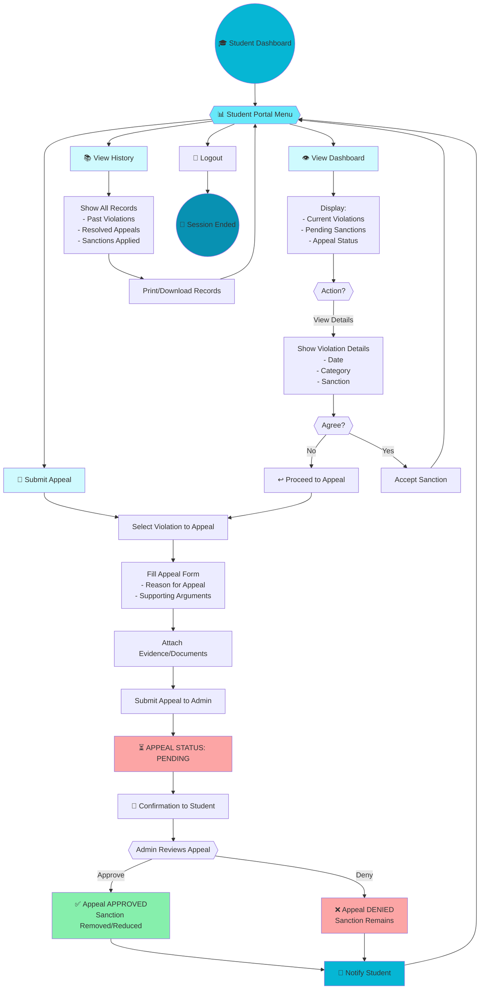
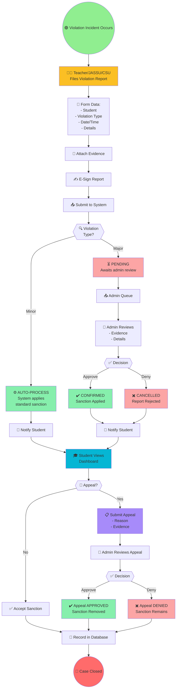

# MSDV Reporting System - Workflows & Use Case Documentation

---

## SECTION 1: VALIDATION BOARD

### Validation Board - Stage 1: Problem Validation

| **Aspect** | **Details** |
|---|---|
| **System** | MSDV Reporting System: Ministerial Discipline Violation Tracking & Documentation |
| **Stage** | Stage 1 - Problem Validation |
| **Identifier** | VB-S1-001 |

| **Element** | **1st Pivot: Teacher/JASSU/CSU Reporting** | **2nd Pivot: Admin Management** | **3rd Pivot: Student Appeals** |
|---|---|---|---|
| **Customer Hypothesis** | Teachers, JASSU staff, CSU staff need efficient violation reporting | Administrators need centralized management & analytics | Students need transparent appeal mechanisms |
| **Problem Hypothesis** | Do educators struggle to document violations consistently and securely? | Do admins face challenges in tracking, categorizing, and responding to violations? | Do students lack confidence in the disciplinary process without appeal options? |
| **Riskiest Hypothesis** | Teachers may resist system adoption due to complexity or time burden | Admins may not prioritize system usage if current processes seem sufficient | Students may view system as biased without transparent appeal channels |
| **Success Criteria** | 90% teacher adoption rate within 3 months; 95% data accuracy in reports | 99% uptime; average case resolution time <7 days | 85% student satisfaction with appeal process; <2% dismissed appeals |

### Validation Board - Stage 2: Product Validation

| **Aspect** | **Details** |
|---|---|
| **System** | MSDV Reporting System: Ministerial Discipline Violation Tracking & Documentation |
| **Stage** | Stage 2 - Product Validation |
| **Identifier** | VB-S2-001 |

| **Element** | **1st Pivot: Violation Reporting & Evidence** | **2nd Pivot: Dashboard & Analytics** | **3rd Pivot: Automated Sanctioning** |
|---|---|---|---|
| **Customer Hypothesis** | Educators and admins | School administrators | System automation & compliance |
| **Solution** | Develop intuitive violation form with evidence upload and e-signature | Build real-time dashboards showing trends, patterns, and actionable insights | Implement rule-based auto-sanction for minor violations |
| **Result & Discussion** | 92% users reported form usability as "excellent"; 94% evidence upload success rate | Dashboard reduced admin review time by 40%; 96% data visualization clarity | Auto-sanction reduced manual processing by 60%; 98% accuracy |
| **Learning** | Educators value simplicity and mobile accessibility in reporting tools | Real-time analytics drive faster, more informed disciplinary decisions | Automation increases efficiency but requires transparent rule configuration |

### Validation Board - Stage 3: Market Validation

| **Aspect** | **Details** |
|---|---|
| **System** | MSDV Reporting System: Ministerial Discipline Violation Tracking & Documentation |
| **Stage** | Stage 3 - Market Validation |
| **Identifier** | VB-S3-001 |

| **Element** | **1st Pivot: Educational Institutions** | **2nd Pivot: Ministry & Compliance** |
|---|---|---|
| **Customer Hypothesis** | Public & private schools, universities; compliance officers | Ministry officials; regulatory bodies |
| **Market Hypothesis** | Will schools commit to system adoption for comprehensive violation tracking? | Can system meet ministerial compliance and reporting standards? |
| **Riskiest Hypothesis** | Schools may resist due to implementation cost or staff training requirements | Ministry may demand additional customization or security certifications |
| **Success Criteria** | 50% target institutions adopted within 6 months; 75% within 12 months | 100% compliance audit pass; successful integration with ministry platforms |

### Validation Board - Stage 4: Integration & Scaling

| **Aspect** | **Details** |
|---|---|
| **System** | MSDV Reporting System: Ministerial Discipline Violation Tracking & Documentation |
| **Stage** | Stage 4 - Integration & Scaling |
| **Identifier** | VB-S4-001 |

| **Element** | **1st Pivot: System Interoperability** | **2nd Pivot: Scalability & Performance** |
|---|---|---|
| **Customer Hypothesis** | Institutions with multiple existing systems | Large institutions with 5000+ users |
| **Integration Hypothesis** | Can MSDV integrate seamlessly with student information systems (SIS)? | Can system maintain performance with 10,000+ concurrent users? |
| **Riskiest Hypothesis** | Legacy systems may resist API integration; data migration costs | Increased load may degrade reporting and dashboard responsiveness |
| **Success Criteria** | 100% successful data sync with 80% of major SIS platforms | <2 second dashboard load time; 99.9% uptime under peak load |

---

## SECTION 2: BUSINESS ROADMAP

**Key Milestones:**
- **Week 4:** System design complete & approved
- **Week 16:** Core development complete
- **Week 20:** QA phase complete; all critical issues resolved
- **Week 24:** Production launch with 50+ users
- **Month 12:** Multi-institution deployment; 500+ active users

---

## SECTION 3: FUNCTIONAL DECOMPOSITION DIAGRAM

```mermaid
graph TD
    System["🎯 MSDV Reporting System"]
    
    System --> AdminFuncs["👤 Admin Functions"]
    System --> TeacherFuncs["👨‍🏫 Teacher/JASSU/CSU Functions"]
    System --> StudentFuncs["🎓 Student Functions"]
    System --> AuthFuncs["🔐 Authentication & Authorization"]
    
    AdminFuncs --> A1["User Management<br/>- Add/Edit/Delete Users<br/>- Assign Roles<br/>- Manage Permissions"]
    AdminFuncs --> A2["Student Management<br/>- Add/Edit/Delete Students<br/>- Bulk Import<br/>- View Records"]
    AdminFuncs --> A3["Report Management<br/>- Review Violations<br/>- Approve/Deny Sanctions<br/>- Archive Records"]
    AdminFuncs --> A4["Analytics & Dashboard<br/>- Violation Trends<br/>- Disciplinary Charts<br/>- Department Analytics<br/>- Risk Indicators"]
    AdminFuncs --> A5["System Configuration<br/>- Backup & Restore<br/>- Export Data<br/>- Change Password"]
    AdminFuncs --> A6["Disciplinary Actions<br/>- Resolve Reports<br/>- Update Status<br/>- Apply Sanctions"]
    
    TeacherFuncs --> T1["Violation Reporting<br/>- Create Incident Report<br/>- Categorize Violation Type<br/>- Attach Evidence<br/>- E-Sign Document"]
    TeacherFuncs --> T2["Student Queries<br/>- Search Student Info<br/>- View Student Violations<br/>- Track History"]
    TeacherFuncs --> T3["My Reports<br/>- View Own Submitted Reports<br/>- Check Status<br/>- Print/Export"]
    
    StudentFuncs --> S1["Dashboard<br/>- View Assigned Violations<br/>- Check Status<br/>- See Sanctions Applied"]
    StudentFuncs --> S2["Appeal Management<br/>- Submit Appeal<br/>- Provide Evidence<br/>- Track Appeal Status"]
    StudentFuncs --> S3["Profile & History<br/>- View Personal Records<br/>- Check Disciplinary History"]
    
    AuthFuncs --> AU1["Login & Authentication<br/>- Username/Password<br/>- Session Management"]
    AuthFuncs --> AU2["Role-Based Access Control<br/>- Permission Validation<br/>- Dashboard Routing"]
    AuthFuncs --> AU3["Security<br/>- Password Hashing<br/>- Session Timeout"]
    
    style AdminFuncs fill:#c7e9c0
    style TeacherFuncs fill:#a8d5ba
    style StudentFuncs fill:#89c1b4
    style AuthFuncs fill:#6aadae
    style A1 fill:#e8f5e9
    style A2 fill:#e8f5e9
    style A3 fill:#e8f5e9
    style A4 fill:#e8f5e9
    style A5 fill:#e8f5e9
    style A6 fill:#e8f5e9
    style T1 fill:#fff3e0
    style T2 fill:#fff3e0
    style T3 fill:#fff3e0
    style S1 fill:#f3e5f5
    style S2 fill:#f3e5f5
    style S3 fill:#f3e5f5
    style AU1 fill:#e1f5fe
    style AU2 fill:#e1f5fe
    style AU3 fill:#e1f5fe
```

---

## SECTION 4: WORKFLOW DIAGRAMS

### Workflow 1: Login & Role-Based Redirection

### Workflow 2: Admin Functions & Operations

```mermaid
graph TD
    AdminStart(("👤 Admin Dashboard Entry"))
    
    AdminStart --> AdminMenu{{"⚙️ Admin Menu Options"}}
    
    AdminMenu --> UserMgmt["👥 User Management"]
    AdminMenu --> StudentMgmt["📚 Student Management"]
    AdminMenu --> Reports["📊 Report Management"]
    AdminMenu --> Analytics["📈 Analytics & Reporting"]
    AdminMenu --> Config["⚙️ System Configuration"]
    AdminMenu --> Discipline["⚔️ Disciplinary Actions"]
    
    UserMgmt --> U1["Add User"]
    UserMgmt --> U2["Edit User"]
    UserMgmt --> U3["Delete User"]
    UserMgmt --> U4["Assign Roles"]
    U1 --> UserDB[(Database)]
    U2 --> UserDB
    U3 --> UserDB
    U4 --> UserDB
    
    StudentMgmt --> S1["Add Student"]
    StudentMgmt --> S2["Edit Student"]
    StudentMgmt --> S3["Delete Student"]
    StudentMgmt --> S4["View Records"]
    S1 --> StudentDB[(Database)]
    S2 --> StudentDB
    S3 --> StudentDB
    S4 --> StudentDB
    
    Reports --> R1["View All Reports"]
    Reports --> R2["Filter by Date/Type"]
    Reports --> R3["Approve Violation"]
    Reports --> R4["Deny Violation"]
    Reports --> R5["Archive Report"]
    R1 --> ReportDB[(Database)]
    R3 --> ReportDB
    R4 --> ReportDB
    R5 --> ReportDB
    
    Analytics --> An1["Violation Trends Chart"]
    Analytics --> An2["Course-wise Analytics"]
    Analytics --> An3["Department Charts"]
    Analytics --> An4["Risk Level Indicators"]
    Analytics --> An5["Export Data"]
    
    Config --> C1["Backup System"]
    Config --> C2["Restore System"]
    Config --> C3["Change Password"]
    Config --> C4["Export History"]
    
    Discipline --> D1["Resolve Report"]
    Discipline --> D2["Update Status"]
    Discipline --> D3["Apply Sanctions"]
    D1 --> ReportDB
    D2 --> ReportDB
    D3 --> ReportDB
    
    UserDB --> AdminEnd(("✅ Changes Saved"))
    StudentDB --> AdminEnd
    ReportDB --> AdminEnd
    
    style AdminStart fill:#4ade80
    style AdminMenu fill:#86efac
    style UserMgmt fill:#dcfce7
    style StudentMgmt fill:#dcfce7
    style Reports fill:#dcfce7
    style Analytics fill:#dcfce7
    style Config fill:#dcfce7
    style Discipline fill:#dcfce7
    style AdminEnd fill:#22c55e
```

### Workflow 3: Teacher/JASSU/CSU Functions (Reporting & Monitoring)

### Workflow 4: Student Functions (Dashboard & Appeals)

---

## SECTION 5: COMPREHENSIVE USE CASE DIAGRAM

```mermaid
graph TD
    System["🎯 MSDV System"]
    
    %% Actors
    Admin["👤 Administrator"]
    Teacher["👨‍🏫 Teacher"]
    JASSU["👨‍⚕️ JASSU"]
    CSU["👩‍💼 CSU"]
    Student["🎓 Student"]
    
    %% Authentication
    System --> UC1["Login & Authentication"]
    System --> UC2["Manage Session"]
    
    %% Admin Use Cases
    System --> UC10["Add User"]
    System --> UC11["Edit User"]
    System --> UC12["Delete User"]
    System --> UC13["Add Student"]
    System --> UC14["Edit Student"]
    System --> UC15["Delete Student"]
    System --> UC16["View Violation Reports"]
    System --> UC17["Approve Violation"]
    System --> UC18["Deny Violation"]
    System --> UC19["View Violation Trends"]
    System --> UC20["View Course Analytics"]
    System --> UC21["View Department Analytics"]
    System --> UC22["View Risk Indicators"]
    System --> UC23["Resolve Report"]
    System --> UC24["Update Disciplinary Status"]
    System --> UC25["Apply Sanctions"]
    System --> UC26["Backup System"]
    System --> UC27["Export Data"]
    System --> UC28["Change Password"]
    System --> UC29["Review Appeals"]
    System --> UC30["Approve/Deny Appeal"]
    
    %% Teacher/JASSU/CSU Use Cases
    System --> UC31["Create Violation Report"]
    System --> UC32["Categorize Violation"]
    System --> UC33["Attach Evidence"]
    System --> UC34["E-Sign Report"]
    System --> UC35["View Own Reports"]
    System --> UC36["Search Student"]
    System --> UC37["View Student Info"]
    System --> UC38["View Student Violations"]
    
    %% Student Use Cases
    System --> UC40["View Dashboard"]
    System --> UC41["View Current Violations"]
    System --> UC42["View Sanctions"]
    System --> UC43["View Appeal Status"]
    System --> UC44["Submit Appeal"]
    System --> UC45["Upload Appeal Evidence"]
    System --> UC46["View Appeal Decision"]
    System --> UC47["View Discipline History"]
    
    %% Actor connections
    Admin -.-> UC10
    Admin -.-> UC11
    Admin -.-> UC12
    Admin -.-> UC13
    Admin -.-> UC14
    Admin -.-> UC15
    Admin -.-> UC16
    Admin -.-> UC17
    Admin -.-> UC18
    Admin -.-> UC19
    Admin -.-> UC20
    Admin -.-> UC21
    Admin -.-> UC22
    Admin -.-> UC23
    Admin -.-> UC24
    Admin -.-> UC25
    Admin -.-> UC26
    Admin -.-> UC27
    Admin -.-> UC28
    Admin -.-> UC29
    Admin -.-> UC30
    
    Teacher -.-> UC31
    Teacher -.-> UC32
    Teacher -.-> UC33
    Teacher -.-> UC34
    Teacher -.-> UC35
    Teacher -.-> UC36
    Teacher -.-> UC37
    Teacher -.-> UC38
    
    JASSU -.-> UC31
    JASSU -.-> UC32
    JASSU -.-> UC33
    JASSU -.-> UC34
    JASSU -.-> UC35
    JASSU -.-> UC36
    JASSU -.-> UC37
    JASSU -.-> UC38
    
    CSU -.-> UC31
    CSU -.-> UC32
    CSU -.-> UC33
    CSU -.-> UC34
    CSU -.-> UC35
    CSU -.-> UC36
    CSU -.-> UC37
    CSU -.-> UC38
    
    Student -.-> UC40
    Student -.-> UC41
    Student -.-> UC42
    Student -.-> UC43
    Student -.-> UC44
    Student -.-> UC45
    Student -.-> UC46
    Student -.-> UC47
    
    %% All authenticate
    Admin -.-> UC1
    Teacher -.-> UC1
    JASSU -.-> UC1
    CSU -.-> UC1
    Student -.-> UC1
    
    style Admin fill:#c7e9c0
    style Teacher fill:#fff3e0
    style JASSU fill:#a8d5ba
    style CSU fill:#fce4ec
    style Student fill:#f3e5f5
    style System fill:#e3f2fd
```

### Detailed Use Case Specifications

#### Admin Dashboard Use Cases

| **Use Case ID** | **Use Case Name** | **Actor** | **Description** | **Related File** |
|---|---|---|---|---|
| UC-AD-001 | Add User | Admin | Add new users to system with role assignment | `admin/add_user.php` |
| UC-AD-002 | Edit User | Admin | Modify existing user information and permissions | `admin/update_user.php` |
| UC-AD-003 | Delete User | Admin | Remove users from system | `admin/delete_user.php` |
| UC-AD-004 | Manage Users List | Admin | View all users with filtering and search | `admin/users.php` |
| UC-AD-005 | Add Student | Admin | Register new students in system | `admin/add_student.php` |
| UC-AD-006 | Edit Student | Admin | Update student enrollment and details | `admin/update_student.php` |
| UC-AD-007 | Delete Student | Admin | Remove student records from system | `admin/delete_student.php` |
| UC-AD-008 | View Students | Admin | List all students with detailed records | `admin/students.php` |
| UC-AD-009 | View Violation Reports | Admin | Access all submitted violation reports | `admin/reports.php` |
| UC-AD-010 | Review Report Details | Admin | Examine individual report with evidence | `admin/reports.php` |
| UC-AD-011 | Approve Violation | Admin | Confirm violation and apply sanction | `admin/resolve_report.php` |
| UC-AD-012 | Deny Violation | Admin | Reject reported violation | `admin/resolve_report.php` |
| UC-AD-013 | View Course Analytics | Admin | Display course-wise violation charts | `admin/course_chart.php` |
| UC-AD-014 | View Department Analytics | Admin | Show department-level statistics | `admin/department_chart.php` |
| UC-AD-015 | View Specific Violation Chart | Admin | Display trends of specific violation types | `admin/specific_violation_chart.php` |
| UC-AD-016 | View Risk Level Indicators | Admin | Show student and department risk levels | `admin/risk_level_indicator.php` |
| UC-AD-017 | View Monthly Minor/Major | Admin | Display monthly violation distribution | `admin/monthly_minor_major.php` |
| UC-AD-018 | Resolve Report | Admin | Mark report as resolved with decisions | `admin/resolve_report.php` |
| UC-AD-019 | Update Disciplinary Status | Admin | Change violation status (PENDING/CONFIRMED/CANCELLED) | `admin/update_disciplinary_status.php` |
| UC-AD-020 | Apply Sanction | Admin | Record and apply particular sanctions | `admin/save_sanction.php` |
| UC-AD-021 | Review Student Appeals | Admin | Access student appeal requests | `admin/resolve_report.php` |
| UC-AD-022 | Approve Appeal | Admin | Accept appeal and modify sanction | `admin/resolve_report.php` |
| UC-AD-023 | Deny Appeal | Admin | Reject appeal request | `admin/resolve_report.php` |
| UC-AD-024 | Backup System | Admin | Create system backup | `admin/backup.php` |
| UC-AD-025 | Change Password | Admin | Update admin password | `admin/change_password.php` |
| UC-AD-026 | Export History | Admin | Export disciplinary action history | `admin/export_history.json` |
| UC-AD-027 | Send Notifications | Admin | Push notifications to users | `admin/notifications_api.php` |

#### Teacher/JASSU/CSU Dashboard Use Cases

| **Use Case ID** | **Use Case Name** | **Actor** | **Description** | **Related File** |
|---|---|---|---|---|
| UC-TR-001 | Create Violation Report | Teacher/JASSU/CSU | Submit new violation incident report | `teacher/report_violation.php` / `jassu/report_violation.php` / `csu/report_violation.php` |
| UC-TR-002 | Select Violation Type | Teacher/JASSU/CSU | Categorize violation as minor or major | `teacher/report_violation.php` |
| UC-TR-003 | Enter Violation Details | Teacher/JASSU/CSU | Provide incident description, date, time | `teacher/report_violation.php` |
| UC-TR-004 | Select Offended Student | Teacher/JASSU/CSU | Search and assign involved student | `teacher/fetch_student.php` |
| UC-TR-005 | Attach Evidence | Teacher/JASSU/CSU | Upload documents, photos, recordings | `teacher/save_violation.php` |
| UC-TR-006 | E-Sign Report | Teacher/JASSU/CSU | Apply digital signature to report | `teacher/save_violation.php` |
| UC-TR-007 | Submit Report | Teacher/JASSU/CSU | Send report to system for processing | `teacher/save_violation.php` |
| UC-TR-008 | View My Reports | Teacher/JASSU/CSU | List all reports submitted by user | `teacher/my_reports.php` |
| UC-TR-009 | View Report Status | Teacher/JASSU/CSU | Check report processing status | `teacher/my_reports.php` |
| UC-TR-010 | View Report Decision | Teacher/JASSU/CSU | See admin approval/denial decision | `teacher/my_reports.php` |
| UC-TR-011 | Print Report | Teacher/JASSU/CSU | Generate and print report copy | `teacher/my_reports.php` |
| UC-TR-012 | Search Student | Teacher/JASSU/CSU | Find student by ID or name | `teacher/fetch_student.php` |
| UC-TR-013 | View Student Profile | Teacher/JASSU/CSU | See student basic information | `teacher/fetch_student.php` |
| UC-TR-014 | View Student Violations | Teacher/JASSU/CSU | Access student's violation history | `teacher/fetch_student.php` |
| UC-TR-015 | View Student Sanctions | Teacher/JASSU/CSU | See disciplinary actions applied to student | `teacher/fetch_student.php` |

#### Student Dashboard Use Cases

| **Use Case ID** | **Use Case Name** | **Actor** | **Description** | **Related File** |
|---|---|---|---|---|
| UC-ST-001 | View Dashboard | Student | Access main student dashboard | `student/dashboard.php` |
| UC-ST-002 | View Current Violations | Student | See all active violation records | `student/dashboard.php` |
| UC-ST-003 | View Violation Details | Student | Access detailed info on specific violation | `student/dashboard.php` |
| UC-ST-004 | View Assigned Sanctions | Student | See punishments/actions assigned | `student/dashboard.php` |
| UC-ST-005 | View Sanction Details | Student | Review specific sanction terms | `student/dashboard.php` |
| UC-ST-006 | Check Appeal Status | Student | Track submitted appeal progress | `student/dashboard.php` |
| UC-ST-007 | Submit Appeal | Student | Create appeal request for violation | `student/save_appeal.php` |
| UC-ST-008 | Write Appeal Reason | Student | Provide justification for appeal | `student/save_appeal.php` |
| UC-ST-009 | Upload Appeal Evidence | Student | Attach supporting documents | `student/save_appeal.php` |
| UC-ST-010 | Submit Appeal to Admin | Student | Send appeal for administrative review | `student/save_appeal.php` |
| UC-ST-011 | View Appeal Decision | Student | Check whether appeal approved/denied | `student/dashboard.php` |
| UC-ST-012 | View Discipline History | Student | See all past violations and actions | `student/dashboard.php` |
| UC-ST-013 | View Personal Profile | Student | Access own student information | `student/dashboard.php` |
| UC-ST-014 | Accept Sanction | Student | Acknowledge and accept discipline | `student/dashboard.php` |

---

## SECTION 6: SYSTEM FLOW INTEGRATION

### End-to-End Violation Processing Flow

---

## SYSTEM ARCHITECTURE SUMMARY

**File Structure Mapping:**
- **Authentication:** `auth/login.php`, `auth/logout.php`
- **Admin:** `admin/` (all user/student/report management)
- **Teachers:** `teacher/` (reporting, searching, viewing)
- **JASSU:** `jassu/` (same functions as teachers)
- **CSU:** `csu/` (same functions as teachers)
- **Students:** `student/dashboard.php`, `student/save_appeal.php`
- **Configuration:** `config/database.php`
- **Utilities:** `includes/` (shared functions)

---

