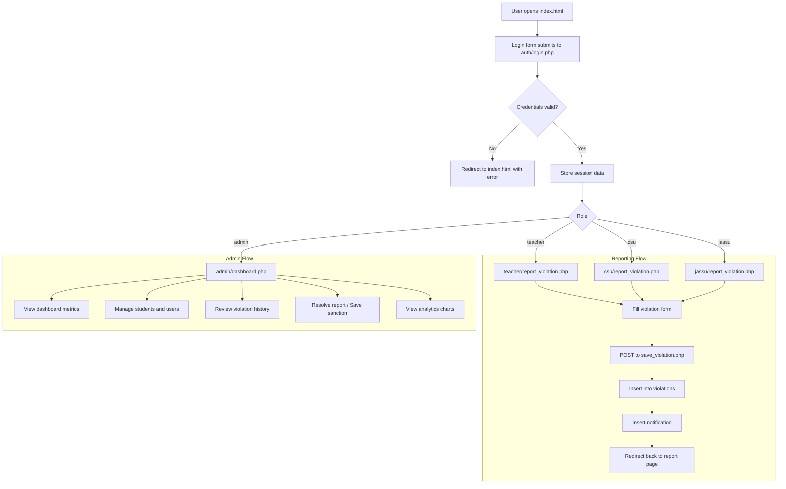

# MSDV Reporting System - Program Workflow

## Overview
This document describes the core workflow of the MSDV Reporting System, from login through role-based task execution. The system supports three main user roles:
- `admin`
- `teacher`
- `csu`
- `jassu`

The workflow covers authentication, report creation, notification generation, and admin case management.

## 1. User Authentication

### Entry point
- `index.html` presents the login form.
- Users enter `username` and `password`.
- The form submits to `auth/login.php`.

### Login processing
- `auth/login.php` connects to the database using `config/database.php`.
- It validates credentials against the `users` table.
- On success, it stores the following session variables:
  - `user_id`
  - `fullname`
  - `role`

### Role-based redirect
- If `role == 'admin'`: redirect to `admin/dashboard.php`
- If `role == 'teacher'`: redirect to `teacher/report_violation.php`
- If `role == 'csu'`: redirect to `csu/report_violation.php`
- If `role == 'jassu'`: redirect to `jassu/report_violation.php`

---

## 2. Teacher / CSU / JASSU Workflow

### Report Violation
- Role-specific report interfaces live in:
  - `teacher/report_violation.php`
  - `csu/report_violation.php`
  - `jassu/report_violation.php`
- Each page checks session validity and enforces the correct role.
- The user fills in a violation form containing:
  - Student details (`student_id`, `student_name`, `course`, `year_level`, `department`)
  - Violation details (`violation_category`, `violation_type`, `description`)
  - Evidence upload (`evidence` file)
  - Camera capture (`camera_capture`)
  - Electronic signature (`e_signature`)

### Saving a violation
- The form submits to `teacher/save_violation.php` (same file is used for all reporting roles by shared logic).
- `save_violation.php` performs the following steps:
  1. Sanitizes submitted inputs.
  2. Moves uploaded evidence into `uploads/`.
  3. Inserts a new record into the `violations` table.
  4. Creates a new notification row in `notifications`.
  5. Alerts the reporter and redirects back to the report page.

### View own reports
- Teachers, CSU, and JASSU can view their submitted reports via `my_reports.php`.
- This page queries `violations` filtered by `reported_by`.

---

## 3. Admin Workflow

### Dashboard
- `admin/dashboard.php` shows system metrics:
  - Total students
  - Total violations
  - Pending sanctions
  - Completed sanctions
- It uses SQL queries against `students` and `violations` tables.

### Violation history and case management
- `admin/reports.php` presents full violation history.
- Admin can review and resolve reports using pages such as:
  - `admin/resolve_report.php`
  - `admin/save_sanction.php`
  - `admin/update_disciplinary_status.php`

### Student and user administration
- Admin manages student records with:
  - `admin/students.php`
  - `admin/add_student.php`
  - `admin/update_student.php`
  - `admin/delete_student.php`
- Admin manages system users with:
  - `admin/users.php`
  - `admin/add_user.php`
  - `admin/update_user.php`
  - `admin/delete_user.php`

### Analytics and reports
- Admin views charts and analytics using:
  - `admin/course_chart.php`
  - `admin/department_chart.php`
  - `admin/specific_violation_chart.php`
  - `admin/monthly_minor_major.php`
  - `admin/risk_level_indicator.php`

### Backup and export
- `admin/backup.php` supports system backup operations.
- Historical export data may be stored in `admin/export_history.json`.

### Notifications
- Real-time notifications are handled by `admin/notifications_api.php`.
- New violation submissions generate `new_violation` notifications.

---

## 4. Common System Actions

### Session enforcement
- All protected pages validate `$_SESSION['user_id']`.
- Each role-specific page checks `$_SESSION['role']` and redirects unauthorized users to `index.html`.

### Logout
- Though not explicitly listed in this workflow, there is a logout flow in `auth/logout.php` to clear the session and return users to the login screen.

### Password management
- `admin/change_password.php` allows logged-in users to update their password.

---

## 5. High-level Flowchart

